# Sketches

The architecture and the user flows, drawn. Mermaid, so GitHub renders them; `docs/ARCHITECTURE.md`
keeps the ASCII versions that read in a terminal and diff line by line, and goes a level deeper on
each. `docs/SYSTEM.md` is the prose record these sketches belong to.

## 1. The system

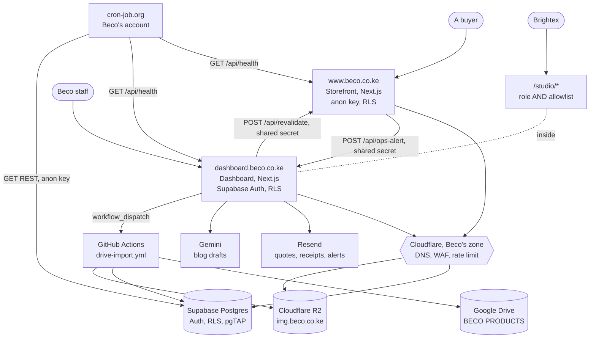

Drive is the source of truth for photography; the database for everything else. Photographs are
regenerable, so R2 is not a data ownership question the way Postgres is.

## 2. The repository

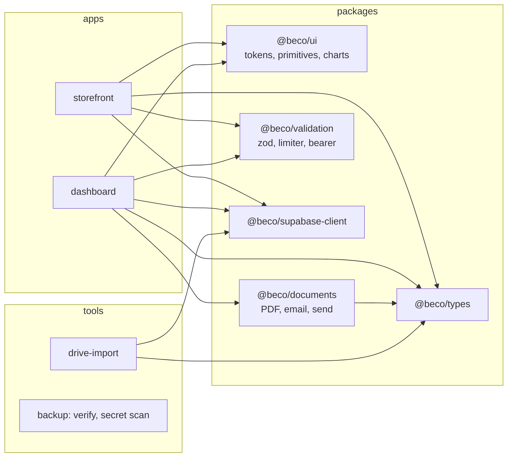

## 3. From a commit to production

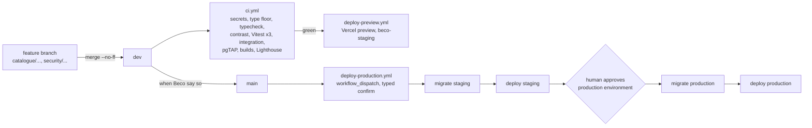

Vercel's own Git integration is switched off. Nothing deploys unless CI passed (D44, D45).

## 4. The data, the parts that matter

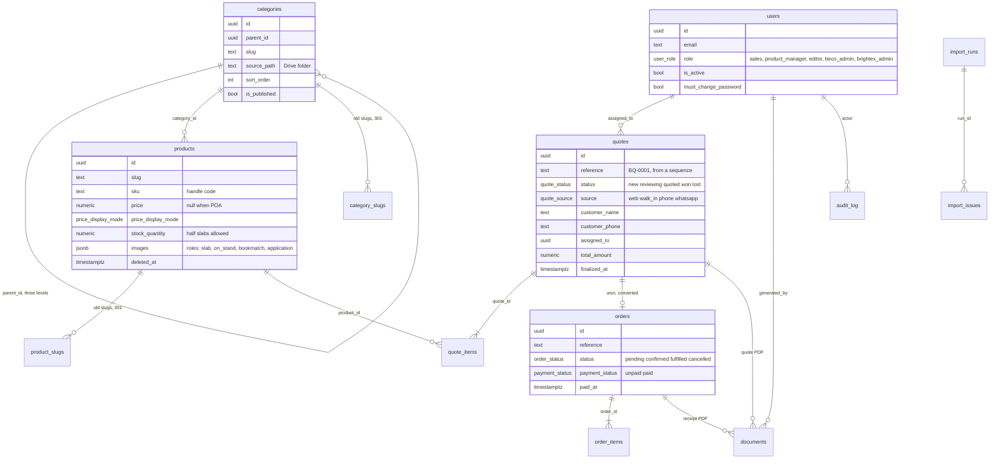

Soft delete on everything commercial; `audit_log` written by triggers only. `docs/SCHEMA.md` has
every column and the RLS intent per table.

## 5. A quote's life

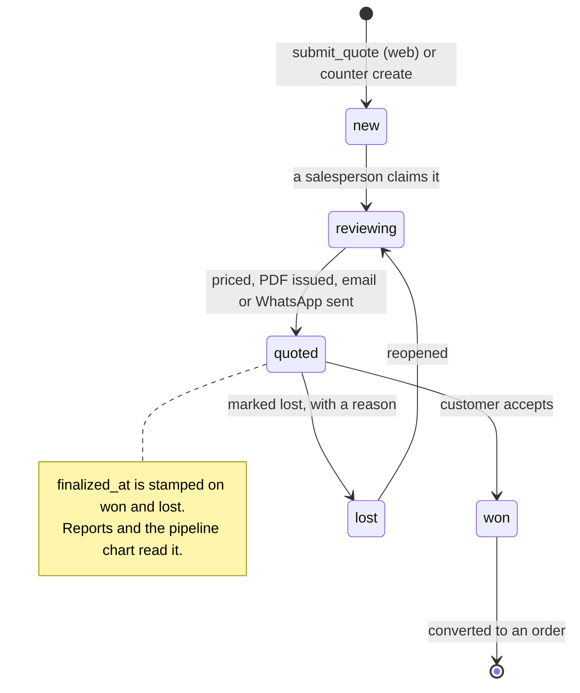

## 6. The web quote, path A

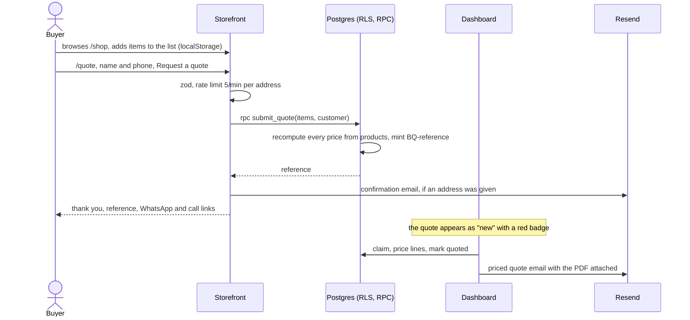

## 7. The counter quote, path B

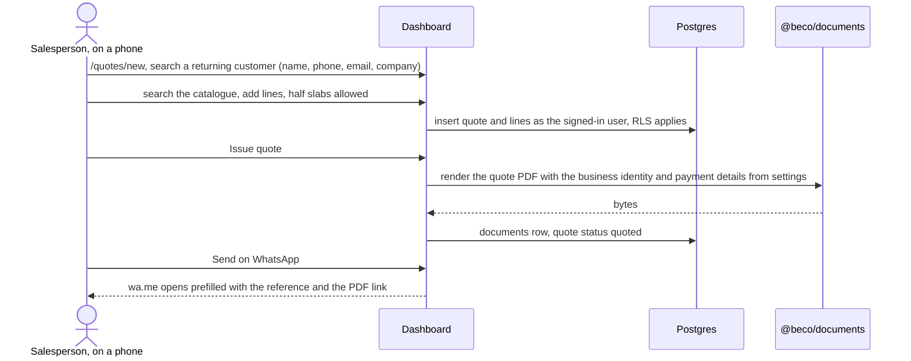

The target is a quote raised, priced and issued faster than writing it on paper. The QA checklist
counts the taps.

## 8. From won to paid

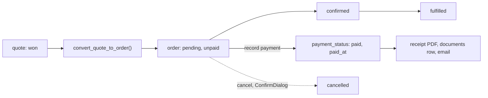

## 9. The Drive import

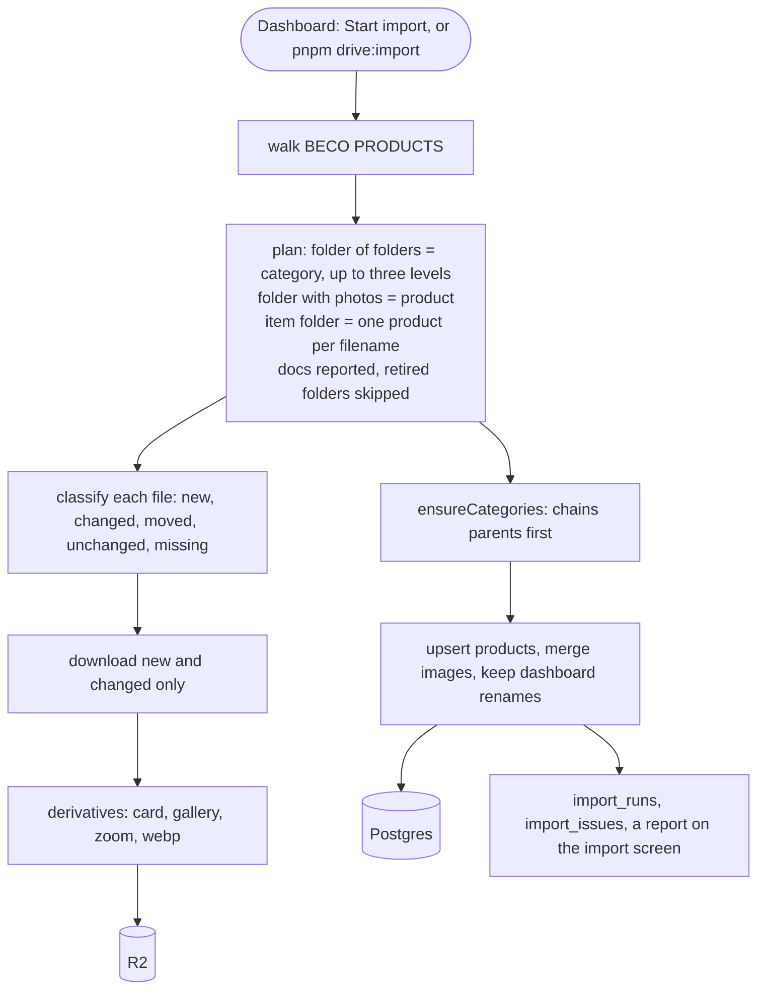

## 10. Signing in, and what a role sees

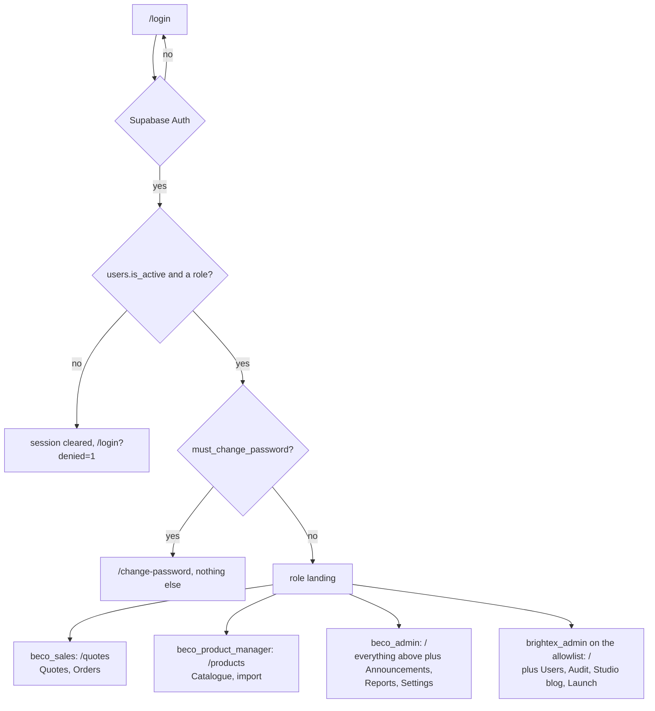

Two layers, always: the proxy decides what a role sees, Postgres RLS decides what it can touch.
`lib/access.ts` is the one map both read.

## 11. A storefront request

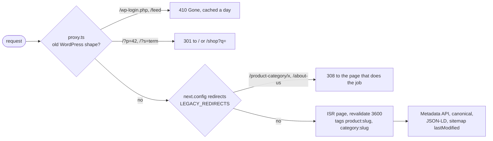

## 12. Keeping the free tiers awake

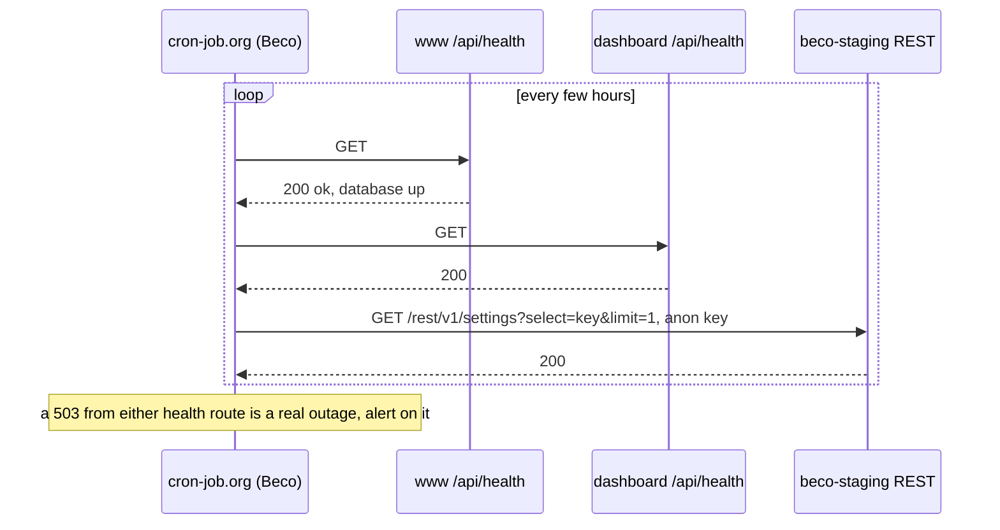
